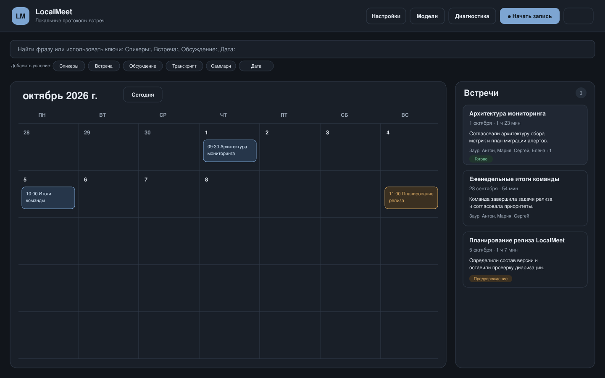
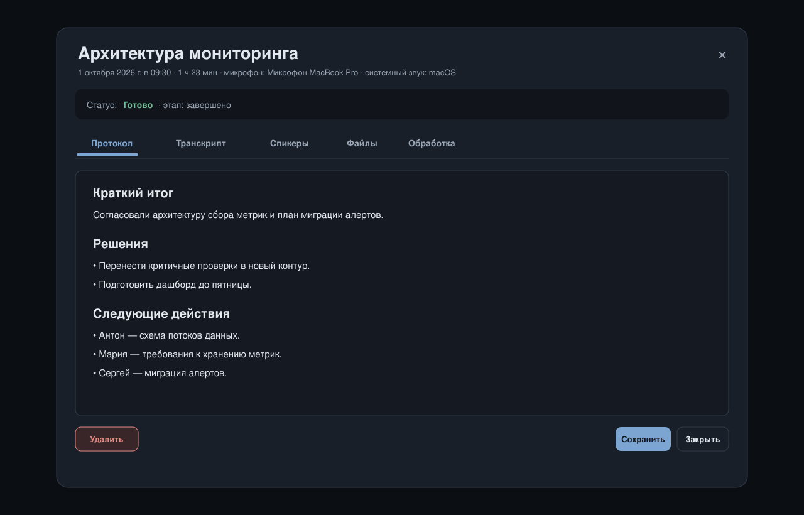
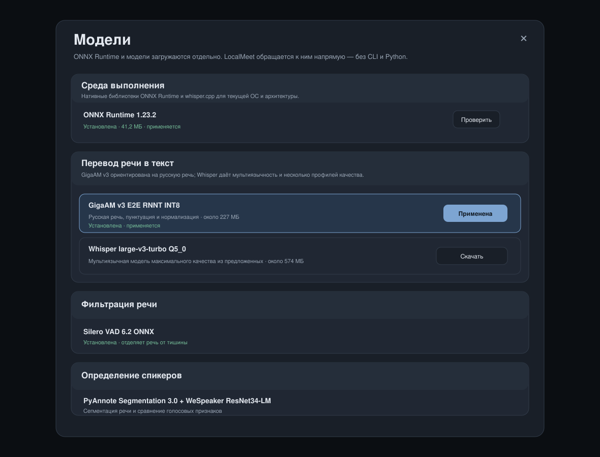

# LocalMeetAssist

Записывает встречи, расшифровывает речь и разделяет участников по голосам — целиком на вашем компьютере.

[Русский](#русский) · [English](#english)

> **Development preview — 0.1.0.** Проект в активной разработке. Форматы конфигурации и данных ещё могут меняться.



<p align="center"><sub>Тёмная тема на демонстрационных данных / Dark theme with demonstration data</sub></p>

---

## Русский

### Что это

LocalMeetAssist записывает встречу с микрофона и системного звука, расшифровывает речь в текст, определяет, кто и когда говорил, и складывает результат в локальный архив, привязывая его ко встрече в собственном календаре. Распознавание и разделение по голосам выполняются на вашем компьютере, ничего не уходит в облако. Интернет нужен только для загрузки моделей и, если нет возможности разместить LLM на локальном компьютере, для обращения к внешней LLM через OpenAI API для создания саммари (протокола встречи).

Аудио захватывает сама программа, а интерфейс управления программой открывается в браузере. Поэтому не нужно выдавать сайту доступ к экрану или вкладке, а запись не прерывается при закрытии вкладки.

### Что умеет

**Запись**

- пишет микрофон и системный звук отдельными дорожками, поэтому ваш голос и голоса собеседников не смешиваются;
- делает общий смешанный поток для удобства прослушивания встречи и подавляет эхо и повторяющиеся реплики;
- запуск записи встречи можно выполнить кнопкой в интерфейсе, с помощью горячей клавиши или автоматически из браузера при использовании плагина, который обнаруживает заранее заданные комнаты конференций;

**Расшифровка и спикеры**

- распознаёт речь локально: GigaAM v3 для русского или Whisper для многоязычных встреч;
- отделяет речь от тишины (Silero VAD) — обработка идёт быстрее, а повторов меньше;
- разделяет удалённых участников по голосам (PyAnnote + WeSpeaker);
- позволяет указать число участников, переименовывать спикеров, объединять их и переносить отдельные реплики;
- показывает прогресс по каждому этапу и даёт повторить или отменить любой из них.

**Архив и поиск**

- календарь встреч по дням с переключением месяц/неделя; в недельном виде каждая встреча стоит на своём часе;
- полнотекстовый поиск встреч по фразам и по условиям: `Speakers:`, `Meeting:`, `Discussion:`, `Transcript:`, `Summary:`, `Date:`;
- фильтры по спикерам, содержанию и датам;
- карточка встречи: транскрипт, спикеры, саммари, аудио и связанные файлы;
- импорт готовых записей WAV, MP3 и Opus — приложение само приведёт их к нужному формату;
- сжатие аудио в Opus после обработки, чтобы архив занимал меньше места.

**Ещё**

- саммари через любой сервер с OpenAI-совместимым API: локальный llama.cpp, Ollama, LM Studio или внешний сервис;
- менеджер моделей: скачивание, проверка и переключение;
- значок в системном трее, глобальные горячие клавиши и индикация идущей записи;
- тёмная и светлая темы, русский и английский интерфейс;
- диагностика: состояние аудиоподсистемы и последние строки лога;

### Как выглядит

Главный экран — календарь встреч. Воронка в углу открывает поиск и фильтры, «+» создаёт встречу вручную, «● Начать запись» запускает запись сразу. Справа — список встреч за выбранный период: наведите на встречу в календаре, и её карточка подсветится, а по нажатию откроется транскрипт со спикерами, саммари и аудио.

| Календарь и поиск | Карточка встречи |
| --- | --- |
|  |  |




### Что нужно для работы

| Профиль | CPU | RAM | Свободное место | Что получится |
| --- | --- | ---: | ---: | --- |
| Минимальный | 4 современных ядра, x86-64 или ARM64 | 8 ГБ | 3 ГБ + место для записей | GigaAM или Whisper small; обработка может идти медленнее реального времени |
| Рекомендуемый | 8 современных ядер; Apple Silicon либо x86-64 с AVX2 | 16 ГБ | 5 ГБ + место для записей | GigaAM/Whisper medium, VAD и диаризация встреч на 1–2 часа |
| Комфортный | 12+ ядер | 24–32 ГБ | SSD, 10+ ГБ + архив | Whisper large-v3-turbo, длинные встречи и работа с другими приложениями |

Дискретная видеокарта не нужна: распознавание, VAD и диаризация идут на процессоре.

Час записи одной дорожки в исходном качестве занимает около **115 МБ**. Вместе с микрофоном, системным звуком и смешанным потоком это временно около **345 МБ на час**; сжатие в Opus заметно уменьшает архив.

### Установка и запуск

Для сбора из исходников. Нужны **Go 1.24+**, C-компилятор и включённый CGO.

```bash
cd meeting-assistant
cp config.example.toml config.toml
CGO_ENABLED=1 go run ./cmd/localmeetassist -config ./config.toml
```

Адрес интерфейса печатается в консоли, и приложение открывает его в браузере само. По умолчанию выбирается случайный свободный порт на `127.0.0.1`.

#### macOS

Установите Command Line Tools:

```bash
xcode-select --install
```

При первом запуске система запросит доступ к микрофону и к записи системного звука. Браузер при этом ничего спрашивать не будет.

#### Windows

Для `go run` нужен MinGW-w64 с GCC в `PATH`. Микрофон и системный звук захватываются через WASAPI.

#### Linux

Пример зависимостей для Debian/Ubuntu:

```bash
sudo apt install build-essential pkg-config libx11-dev libayatana-appindicator3-dev
```

Для PipeWire нужен PulseAudio-совместимый monitor-источник (`pipewire-pulse`). Точный набор пакетов зависит от дистрибутива и рабочего окружения.

### Первый запуск

1. Откройте **«Модели»** и скачайте ONNX Runtime.
2. Скачайте одну модель распознавания — GigaAM для русского или Whisper для многоязычных встреч — и примените её.
3. Скачайте Silero VAD. Для разделения по голосам добавьте PyAnnote Segmentation и WeSpeaker.
4. Загляните в **«Диагностику»**: там должно быть написано, что аудио готово. Если нет — проверьте разрешения и выбранные устройства.
5. В **«Настройках»** включите только те этапы, которые должны запускаться сами после записи: расшифровку, разделение спикеров, саммари.
6. Сделайте пробную запись: **«● Начать запись»**, пара минут разговора, **«■ Завершить»**. Через несколько секунд встреча появится в календаре.
7. Откройте её и проверьте результат: текст с таймкодами, список спикеров, саммари. Спикеров можно переименовать, а ошибочные реплики — перенести.

Отключённый автоматический этап не пропадает: его всегда можно запустить вручную из карточки встречи.

### Расширение для браузера

Расширение избавляет от ручного запуска: оно следит за вкладками, подходящими под маски встреч, и само начинает запись или предлагает подтвердить её. Аудио по-прежнему захватывает приложение — расширение не получает доступ ни к микрофону, ни к экрану, ни к звуку вкладки.

Поддерживаются Chrome, Edge и Firefox. Готовые сборки лежат в репозитории:

```text
browser-extension/dist/chrome     для Chrome и Edge
browser-extension/dist/firefox    для Firefox
browser-extension/packages/       те же сборки в ZIP — для подписи или переноса
```

**Подготовьте приложение**

1. Закрепите порт: `app.listen_port` в `config.toml` не должен быть `0`. Иначе после перезапуска адрес изменится и расширение потеряет связь.
2. Откройте **«Интеграции» → «Браузер»**, включите интеграцию и создайте plugin-токен. Значение `lma_pl_…` показывается один раз — сразу скопируйте его.
3. Задайте маски встреч (например, адреса ваших созвонов) и режим: `auto` — запись начинается сама, `notify` — приложение спрашивает подтверждение.
4. Проверьте устройства и разрешения в приложении: расширение за звук не отвечает.

**Установка в Chrome и Edge**

1. Распакуйте архив в постоянную папку и не переносите её после установки.
2. Откройте `chrome://extensions` (в Edge — `edge://extensions`) и включите **режим разработчика**.
3. Нажмите **«Загрузить распакованное расширение»** и выберите папку `browser-extension/dist/chrome`.
4. Откройте настройки расширения, укажите порт приложения и токен.

Если режим разработчика запрещён политикой компании, установку должен разрешить администратор.

**Установка в Firefox**

- *Временно, для проверки:* `about:debugging#/runtime/this-firefox` → **«Загрузить временное дополнение»** → `browser-extension/dist/firefox/manifest.json`. Такое дополнение исчезнет при перезапуске браузера.
- *Постоянно:* обычному Firefox Release нужен подписанный XPI. Отправьте `browser-extension/packages/localmeetassist-firefox-0.1.0.zip` на подпись в [AMO Developer Hub](https://addons.mozilla.org/developers/) — можно выбрать самостоятельное распространение без публичной карточки — и установите полученный файл через `about:addons` → **«Установить дополнение из файла»**.

**Сборка расширения из исходников**

```bash
cd browser-extension
npm run package
```

Нужен Node.js 22+. Сторонних зависимостей нет: команда соберёт обе сборки, проверит манифесты, прогонит тесты и положит ZIP в `artifacts/`.

Подробности, обновление, удаление и решение проблем — в [browser-extension/INSTALL.md](browser-extension/INSTALL.md). Контракт сервера описан в [docs/BROWSER_PLUGIN.md](docs/BROWSER_PLUGIN.md).

### Что скачивается в «Моделях»

Модели и нативные runtime не входят в репозиторий. Загружается только то, что вы выбрали: для обычной работы достаточно одной модели распознавания, VAD и двух моделей диаризации.

| Назначение | Модель | Размер | Комментарий |
| --- | --- | ---: | --- |
| Русская расшифровка | GigaAM v3 E2E RNNT INT8 | ~227 МБ | Рекомендуемый вариант для русской речи: пунктуация и нормализация |
| Многоязычная расшифровка | Whisper small Q5_1 | ~181 МБ | Самый быстрый вариант для слабых процессоров |
| Многоязычная расшифровка | Whisper medium Q5_0 | ~514 МБ | Баланс точности и скорости |
| Многоязычная расшифровка | Whisper large-v3-turbo Q5_0 | ~574 МБ | Максимальное качество среди предлагаемых Whisper |
| Детектор речи | Silero VAD 6.2 ONNX | ~2,3 МБ | Убирает тишину из обработки и помогает против повторов |
| Сегментация спикеров | PyAnnote Segmentation 3.0 ONNX | ~6 МБ | Определяет интервалы активности голосов |
| Голосовые признаки | WeSpeaker ResNet34-LM VoxCeleb | ~27 МБ | Сравнивает голосовые фрагменты перед кластеризацией |
| Выполнение ONNX | ONNX Runtime 1.23.2 | зависит от ОС | Нужен для GigaAM, VAD и диаризации |
| Выполнение Whisper | whisper.cpp runtime | зависит от ОС | Загружается только при выборе Whisper |

Полный каталог занимает около **1,6 ГБ** плюс нативные runtime.

### Сервер для саммари

LocalMeetAssist не запускает LLM сам. Он обращается к любому серверу с OpenAI-совместимым `/v1/chat/completions`: llama.cpp, Ollama, LM Studio, vLLM или удалённому API. Память указана ориентировочно и включает запас под контекст — длинный транскрипт увеличивает KV-кэш.

| Модель | Подходящая конфигурация | Ориентир по памяти | Когда выбирать |
| --- | --- | ---: | --- |
| [Qwen3.5-9B-GGUF](https://huggingface.co/unsloth/Qwen3.5-9B-GGUF) `UD-Q4_K_XL` | 16 ГБ RAM или 8–12 ГБ VRAM | модель ~5,7 ГБ; желательно 10–14 ГБ доступной памяти | Вариант по умолчанию: русский язык, хорошее следование структуре протокола |
| [Gemma 3 12B IT](https://huggingface.co/google/gemma-3-12b-it) Q4 | 16–24 ГБ RAM/VRAM | модель ~7–8 ГБ; желательно 12–18 ГБ | Сильное многоязычное резюмирование и большой контекст; требуется принять лицензию Gemma |
| [Mistral Small 3.2 24B Instruct](https://huggingface.co/mistralai/Mistral-Small-3.2-24B-Instruct-2506) Q4_K_M | 32 ГБ RAM или 16–24 ГБ VRAM | модель ~14,3 ГБ; желательно 22–28 ГБ | Более точные решения и формулировки на мощной рабочей станции |
| [Qwen3.5-35B-A3B-GGUF](https://huggingface.co/unsloth/Qwen3.5-35B-A3B-GGUF) `UD-Q4_K_XL` | 32 ГБ RAM или 24 ГБ VRAM | файл ~22,2 ГБ; желательно 28–32 ГБ | Качественная локальная саммаризация при достаточной памяти |

Быстрый старт с llama.cpp:

```bash
llama-server -hf unsloth/Qwen3.5-9B-GGUF:UD-Q4_K_XL \
  --host 127.0.0.1 --port 8080 --ctx-size 32768
```

В настройках LocalMeetAssist укажите:

```text
URL API: http://127.0.0.1:8080/v1
Модель: unsloth/Qwen3.5-9B-GGUF:UD-Q4_K_XL
Токен: пусто, если локальный сервер не требует авторизации
```

Для часовой встречи 32K контекста может не хватить: увеличьте `--ctx-size` в пределах доступной памяти либо используйте сервер с большим контекстом.

### Где лежат данные

По умолчанию всё хранится в `./data`:

```text
data/
├── database/meetings.db
├── logs/localmeetassist.log
└── meetings/YYYY/MM/<meeting-uid>/
```

Чтобы перенести встречи из старой установки, остановите LocalMeetAssist, скопируйте каталоги встреч в новый `data/meetings` и запустите приложение. При старте оно сверит файловое дерево с базой и восстановит встречи, артефакты, транскрипты, саммари и спикеров. Если остался только Opus или MP3, рабочая копия WAV восстановится при повторной обработке.

### Приватность и сеть

- Запись, расшифровка, VAD и диаризация выполняются локально.
- Интерфейс слушает только `127.0.0.1` и открывается по одноразовой ссылке, которую приложение выдаёт браузеру при запуске.
- Внешние клиенты подключаются по интеграционным токенам с ограниченной областью прав.
- Расширение для браузера соединяется только с `ws://127.0.0.1:<порт приложения>` и хранит токен в профиле браузера, недоступным содержимому страниц.
- Сеть нужна для загрузки моделей и для саммари, если выбран удалённый API. С локальным сервером LLM весь путь остаётся на вашем компьютере.

### Проверка

```bash
CGO_ENABLED=1 go test ./...
CGO_ENABLED=1 go vet ./...
```

Проверка браузерного расширения:

```bash
cd browser-extension
npm run check
npm test
```

> На macOS линковщик может напечатать `ld: warning: ignoring duplicate libraries: '-lc++', '-lobjc'`. Предупреждение безвредно: `ld` отбрасывает повторяющиеся флаги, бинарник собирается корректно. Погасить его можно переменной окружения — `CGO_LDFLAGS="-Wl,-no_warn_duplicate_libraries" go build ./...`.

Дополнительная документация: [архитектура](docs/ARCHITECTURE.md), [API](docs/API.md), [браузерное расширение](docs/BROWSER_PLUGIN.md), [тестирование](docs/TESTING.md).

### Лицензия

Код LocalMeetAssist распространяется по лицензии [MIT](LICENSE). Модели и нативные runtime имеют собственные лицензии; проверяйте условия перед распространением готовой сборки.

---
## English

### What it is

LocalMeetAssist records a meeting from the microphone and system audio, transcribes the speech, works out who spoke when, and keeps the result in a local archive attached to the meeting in its own calendar. Recognition and speaker separation run on your own computer and nothing goes to the cloud. Network access is only needed to download models and, if you cannot host an LLM locally, to call an external LLM over the OpenAI API to produce a summary (meeting minutes).

The application captures audio itself, while the control interface opens in a browser. That means no screen or tab permission is requested from the site, and closing the tab does not interrupt a recording.

### What it can do

**Recording**

- captures the microphone and system audio as separate tracks, so your voice and your guests' voices never blend;
- produces a mixed track for convenient listening and suppresses echo and duplicated lines;
- recording can be started from a button in the interface, with a hotkey, or automatically from the browser by the plugin that detects preconfigured conference rooms;

**Transcription and speakers**

- recognises speech locally: GigaAM v3 for Russian or Whisper for multilingual meetings;
- separates speech from silence (Silero VAD), which speeds up processing and reduces repetitions;
- separates remote participants by voice (PyAnnote + WeSpeaker);
- lets you set the participant count, rename speakers, merge them, and move individual lines;
- reports progress for every stage and lets you retry or cancel any of them.

**Archive and search**

- a calendar of meetings with month and week views; in the week view each meeting sits on its own hour;
- full-text meeting search by phrase and by terms such as `Speakers:`, `Meeting:`, `Discussion:`, `Transcript:`, `Summary:`, `Date:`;
- filters by speakers, content, and dates;
- a meeting card with the transcript, speakers, summary, audio, and related files;
- import of existing WAV, MP3, and Opus recordings — the application converts them itself;
- optional Opus compression after processing to keep the archive small.

**Also**

- summaries through any server with an OpenAI-compatible API: local llama.cpp, Ollama, LM Studio, or a remote service;
- a model manager for downloading, validating, and switching models;
- a system tray icon, global hotkeys, and a recording indicator;
- dark and light themes, Russian and English interfaces;
- diagnostics with audio subsystem state and recent log lines;

### What it looks like

The main screen is the meeting calendar. The funnel in the corner opens search and filters, "+" creates a meeting by hand, and "● Start recording" begins recording immediately. The list on the right shows the meetings of the selected period: hover a calendar entry to highlight its card, and click to open the transcript with speakers, the summary, and the audio.

| Calendar and search | Meeting details |
| --- | --- |
|  |  |


### What you need

| Profile | CPU | RAM | Free storage | What to expect |
| --- | --- | ---: | ---: | --- |
| Minimum | 4 modern cores, x86-64 or ARM64 | 8 GB | 3 GB + recordings | GigaAM or Whisper small; processing may be slower than real time |
| Recommended | 8 modern cores; Apple Silicon or x86-64 with AVX2 | 16 GB | 5 GB + recordings | GigaAM/Whisper medium, VAD, and diarization for 1–2 hour meetings |
| Comfortable | 12+ cores | 24–32 GB | SSD, 10+ GB + archive | Whisper large-v3-turbo, long meetings, and multitasking |

A discrete GPU is not required: recognition, VAD, and diarization run on the CPU.

One hour of a single source track takes about **115 MB** in its original quality. Together with microphone, system audio, and the mixed track that is temporarily about **345 MB per hour**; Opus compression shrinks the archive considerably.

### Install and run

Building from source. You need **Go 1.24+**, a C compiler, and CGO enabled.

```bash
cd meeting-assistant
cp config.example.toml config.toml
CGO_ENABLED=1 go run ./cmd/localmeetassist -config ./config.toml
```

The interface address is printed to the console, and the application opens it in your browser. By default it picks a random free port on `127.0.0.1`.

#### macOS

Install the Command Line Tools:

```bash
xcode-select --install
```

On the first run macOS asks for microphone and system-audio recording access. The browser is not asked for anything.

#### Windows

`go run` needs MinGW-w64 with GCC on `PATH`. Microphone and system audio are captured through WASAPI.

#### Linux

Debian/Ubuntu example:

```bash
sudo apt install build-essential pkg-config libx11-dev libayatana-appindicator3-dev
```

PipeWire needs a PulseAudio-compatible monitor source (`pipewire-pulse`). Exact packages depend on your distribution and desktop environment.

### First run

1. Open **Models** and download ONNX Runtime.
2. Download and apply one recognition model — GigaAM for Russian or Whisper for multilingual meetings.
3. Download Silero VAD. For speaker separation add PyAnnote Segmentation and WeSpeaker.
4. Check **Diagnostics**: it should say that audio is ready. If not, review permissions and the selected devices.
5. In **Settings**, enable only the stages that should run automatically after a recording: transcription, speaker separation, summarization.
6. Make a test recording: **Start recording**, talk for a couple of minutes, then **Finish**. The meeting appears in the calendar within seconds.
7. Open it and check the result: text with timecodes, the speaker list, the summary. Speakers can be renamed and misplaced lines moved.

A disabled automatic stage is not lost — you can always run it manually from the meeting card.

### Browser extension

The extension removes the manual step: it watches tabs that match your meeting masks and either starts recording or asks you to confirm. Audio is still captured by the application — the extension never gets access to the microphone, the screen, or tab audio.

Chrome, Edge, and Firefox are supported. Ready builds are in the repository:

```text
browser-extension/dist/chrome     for Chrome and Edge
browser-extension/dist/firefox    for Firefox
browser-extension/packages/       the same builds as ZIP files for signing or transfer
```

**Prepare the application**

1. Pin the port: `app.listen_port` in `config.toml` must not be `0`. Otherwise the address changes on restart and the extension loses the connection.
2. Open **Integrations → Browser**, enable the integration, and create a plugin token. The `lma_pl_…` value is shown once — copy it right away.
3. Set meeting masks (your conference URLs, for example) and the mode: `auto` starts recording, `notify` asks for confirmation.
4. Verify devices and permissions in the application: the extension is not responsible for audio.

**Install in Chrome and Edge**

1. Unpack the archive into a permanent folder and do not move it afterwards.
2. Open `chrome://extensions` (`edge://extensions` in Edge) and enable **Developer mode**.
3. Click **Load unpacked** and select `browser-extension/dist/chrome`.
4. Open the extension options and enter the application port and token.

If your company policy forbids Developer mode, an administrator has to allow the installation.

**Install in Firefox**

- *Temporary, for testing:* `about:debugging#/runtime/this-firefox` → **Load Temporary Add-on** → `browser-extension/dist/firefox/manifest.json`. Such an add-on disappears when the browser restarts.
- *Permanent:* Firefox Release requires a signed XPI. Submit `browser-extension/packages/localmeetassist-firefox-0.1.0.zip` to [AMO Developer Hub](https://addons.mozilla.org/developers/) for signing — self-distribution without a public listing is allowed — and install the resulting file via `about:addons` → **Install Add-on From File**.

**Build the extension from source**

```bash
cd browser-extension
npm run package
```

Node.js 22+ is required. There are no third-party dependencies: the command builds both targets, validates the manifests, runs the tests, and writes ZIP files to `artifacts/`.

Detailed steps, updates, removal, and troubleshooting are in [browser-extension/INSTALL.md](browser-extension/INSTALL.md). The server contract is described in [docs/BROWSER_PLUGIN.md](docs/BROWSER_PLUGIN.md).

### What Models downloads

Models and native runtimes are not committed to the repository. Only what you choose is downloaded: a normal installation needs one recognition model, VAD, and the two diarization models.

| Purpose | Model | Size | Notes |
| --- | --- | ---: | --- |
| Russian transcription | GigaAM v3 E2E RNNT INT8 | ~227 MB | Recommended for Russian speech: punctuation and normalization |
| Multilingual transcription | Whisper small Q5_1 | ~181 MB | Fastest option for lower-end CPUs |
| Multilingual transcription | Whisper medium Q5_0 | ~514 MB | Accuracy and speed balance |
| Multilingual transcription | Whisper large-v3-turbo Q5_0 | ~574 MB | Highest quality among the offered Whisper models |
| Voice activity detection | Silero VAD 6.2 ONNX | ~2.3 MB | Removes silence from processing and helps reduce repetitions |
| Speaker segmentation | PyAnnote Segmentation 3.0 ONNX | ~6 MB | Detects voice activity intervals |
| Speaker embeddings | WeSpeaker ResNet34-LM VoxCeleb | ~27 MB | Compares voice fragments before clustering |
| ONNX execution | ONNX Runtime 1.23.2 | platform-dependent | Required for GigaAM, VAD, and diarization |
| Whisper execution | whisper.cpp runtime | platform-dependent | Only downloaded when Whisper is selected |

The full catalogue takes about **1.6 GB** plus the native runtimes.

### Summarization server

LocalMeetAssist does not run an LLM itself. It calls any OpenAI-compatible `/v1/chat/completions` server: llama.cpp, Ollama, LM Studio, vLLM, or a remote API. Memory figures are approximate and include headroom for the context — a long transcript grows the KV cache.

| Model | Suggested machine | Memory guidance | Best fit |
| --- | --- | ---: | --- |
| [Qwen3.5-9B-GGUF](https://huggingface.co/unsloth/Qwen3.5-9B-GGUF) `UD-Q4_K_XL` | 16 GB RAM or 8–12 GB VRAM | ~5.7 GB model; 10–14 GB available recommended | Default choice: Russian language and reliable structured summaries |
| [Gemma 3 12B IT](https://huggingface.co/google/gemma-3-12b-it) Q4 | 16–24 GB RAM/VRAM | ~7–8 GB model; 12–18 GB available recommended | Strong multilingual summaries and long context; Gemma licence acceptance required |
| [Mistral Small 3.2 24B Instruct](https://huggingface.co/mistralai/Mistral-Small-3.2-24B-Instruct-2506) Q4_K_M | 32 GB RAM or 16–24 GB VRAM | ~14.3 GB model; 22–28 GB available recommended | Better decisions and wording on a workstation |
| [Qwen3.5-35B-A3B-GGUF](https://huggingface.co/unsloth/Qwen3.5-35B-A3B-GGUF) `UD-Q4_K_XL` | 32 GB RAM or 24 GB VRAM | ~22.2 GB file; 28–32 GB available recommended | High-quality local summaries when memory allows |

Quick start with llama.cpp:

```bash
llama-server -hf unsloth/Qwen3.5-9B-GGUF:UD-Q4_K_XL \
  --host 127.0.0.1 --port 8080 --ctx-size 32768
```

Then set in LocalMeetAssist:

```text
API URL: http://127.0.0.1:8080/v1
Model: unsloth/Qwen3.5-9B-GGUF:UD-Q4_K_XL
Token: empty if the local server needs no authorization
```

A one-hour meeting may not fit into 32K of context. Raise `--ctx-size` within your available memory, or use a server with a larger context.

### Where the data lives

Everything is stored under `./data` by default:

```text
data/
├── database/meetings.db
├── logs/localmeetassist.log
└── meetings/YYYY/MM/<meeting-uid>/
```

To move meetings from an older installation, stop LocalMeetAssist, copy the meeting directories into the new `data/meetings`, and start the application. On startup it reconciles the file tree with the database and restores meetings, artifacts, transcripts, summaries, and speakers. If only Opus or MP3 is left, reprocessing restores a working WAV copy.

### Privacy and networking

- Recording, transcription, VAD, and diarization run locally.
- The interface listens only on `127.0.0.1` and is opened through a one-time link that the application hands to your browser at startup.
- External clients connect with integration tokens limited to a scope.
- The browser extension connects only to `ws://127.0.0.1:<application port>` and keeps its token in the browser profile, out of reach of page content.
- Network access is needed to download models and for summaries when a remote API is configured. With a local LLM server the whole path stays on your computer.

### Verification

```bash
CGO_ENABLED=1 go test ./...
CGO_ENABLED=1 go vet ./...
```

Browser extension checks:

```bash
cd browser-extension
npm run check
npm test
```

> On macOS the linker may print `ld: warning: ignoring duplicate libraries: '-lc++', '-lobjc'`. It is harmless: `ld` drops the repeated flags and the binary is correct. To silence it, set `CGO_LDFLAGS="-Wl,-no_warn_duplicate_libraries" go build ./...`.

Additional documentation: [architecture](docs/ARCHITECTURE.md), [API](docs/API.md), [browser extension](docs/BROWSER_PLUGIN.md), and [testing](docs/TESTING.md).

### License

LocalMeetAssist source code is released under the [MIT License](LICENSE). Models and native runtimes have their own licenses; review them before redistributing a packaged build.
